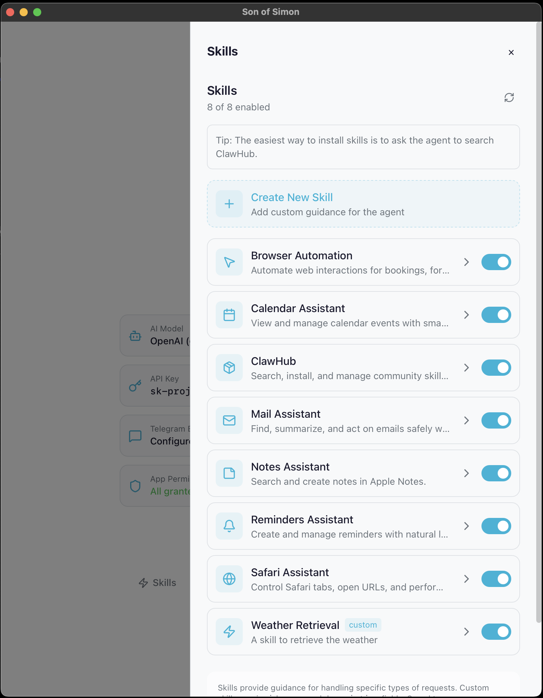

<p align="center">
  
</p>

<h1 align="center">Son of Simon</h1>

<p align="center">
  <em>Your personal Mac assistant. Built-in apps. Voice messages. Secure by default. No setup headaches.</em>
</p>

## Why

Your Mac is already set up. Why should an AI make you do it again with OAuth and gateways?


## What is this?

Son of Simon is an AI assistant for macOS that works directly with your built-in Apple apps — Mail, Calendar, Reminders, Notes, and Safari.

Where many agent tools rely on browser automation or OAuth flows to access Gmail or Office 365, Son of Simon leans on Apple's native app integration. Add your account in Apple Mail/Calendar and the agent can use it.

Son of Simon does not require a separate local gateway service for normal use. That reduces moving parts and attack surface compared to gateway-based setups.

Skills are compatible with the [AgentSkills standard](https://agentskills.io) used by OpenClaw, Claude Code, and Cursor — so community skills work across tools. Almost any skill from https://clawhub.ai will work.

You do not need to code. Download the app, sign in, and start asking.

## What it can do

**Mail** — search, read, send, archive, download attachments across all accounts

**Calendar & Reminders** — create events, check your schedule, set reminders, mark them done

**Notes** — create, search, organize into folders, move and delete notes

**Safari & Browser** — open URLs, read pages, click buttons, fill forms, take screenshots, run JavaScript

**WhatsApp** — read chats, search messages, send replies via `whatsapp-cli`

**Telegram** — send and receive messages (text or voice), use as remote control for the agent

**Microsoft Teams** — list teams and channels, read and send channel and chat messages (multi-account)

**Spotlight** — find files by name, content, type, or recently opened

**Paperless-ngx** — search, upload, download, and tag documents

**Web** — Google search, fetch URLs, read Hacker News

**Files** — read, write, and search files on disk

**Memory** — remembers facts, preferences, and lessons across sessions

### Complex workflows

Because it chains tools automatically, you can ask for things like:

- *"My mom sent me her vacation dates by email — add them to my calendar"* — searches mail, extracts dates, creates calendar events
- *"Summarize my unread emails and send me a Telegram message with the highlights"* — reads inbox, summarizes, sends via Telegram
- *"Find the PDF invoice from last week and upload it to Paperless"* — searches Spotlight, reads the file, uploads to Paperless-ngx
- *"Check my reminders, mark the ones I've done, and create notes for the rest"* — lists reminders, completes some, creates notes
- *"What did Frank say on WhatsApp about the contract? Reply that I'll review it tomorrow"* — searches WhatsApp messages, sends reply
- *"Book the 3pm slot on that website I have open in Safari"* — reads the open tab, navigates the form, fills it out

### Background service

- **Cron jobs** — run any prompt on a schedule (daily inbox summary, weekly review, etc.)
- **Heartbeat** — a configurable prompt that runs periodically while the service is active (`~/.macbot/heartbeat.md`)

## How it works (simple version)

- It uses your built-in Apple apps instead of screen scraping
- It uses the browser only when it has to
- It can listen to your Telegram voice messages if you want remote control

## Get started (most people)

1. Download the latest `.dmg` from Releases
2. Drag Son of Simon to your Applications folder
3. Open it and follow the setup steps

The setup wizard will guide you through:
- Connecting your AI provider (Anthropic, OpenAI, or OpenRouter)
- Choosing a model (Claude, GPT-5, DeepSeek, Gemini, GLM, Llama, and more)
- Granting macOS permissions
- Optional Telegram setup

First success (safe demo prompts):
- "What's on my calendar today? (Read-only.)"
- "Summarize my unread emails and highlight anything urgent. Don't reply or send anything."
- "Search my Notes for anything about <keyword> and summarize what you find."

<p align="center">
  
</p>

## Skills (AgentSkills compatible)

Skills provide guidance for handling specific types of requests. Son of Simon comes with built-in skills for Mail, Calendar, Reminders, Notes, Safari, and Browser Automation. You can enable or disable skills, customize built-in ones, or create your own.

<p align="center">
  
</p>

Each skill defines:
- Which apps and tasks it uses
- Example prompts that trigger it
- Safe defaults to prevent mistakes
- Actions that require your confirmation

Custom skills are saved to `~/.macbot/skills/`. Skills use the **AgentSkills standard** (the same SKILL.md format used by OpenClaw, Claude Code, and Cursor) so you can drop in skills from any compatible tool and they just work.

### Install skills from ClawHub

[ClawHub](https://clawhub.ai) is a community registry of agent skills. You can browse and install skills directly by asking the agent:

> "Search ClawHub for a Slack skill"
> "Install https://clawhub.ai/steipete/slack"

The agent will install the skill and automatically enrich it with task mappings and behavior notes so it works out of the box. You can also use the CLI:

```bash
npm install -g clawhub                              # one-time setup
clawhub search slack                                 # find skills
clawhub install --dir ~/.macbot/skills slack          # install
son skills enrich slack                              # enrich with AI
```

## AI providers and models

Son of Simon works with multiple AI providers. Pick one during setup or change it later in `~/.macbot/.env`.

| Provider | Models | Key prefix |
|---|---|---|
| **Anthropic** | Claude Sonnet 4.5, Opus 4.6, Haiku 4.5 | `sk-ant-` |
| **OpenAI** | GPT-5.2, GPT-5.2 Pro, GPT-5.1, GPT-5 Mini, o4-mini | `sk-proj-` |
| **OpenRouter** | DeepSeek V3.2, Gemini 2.5 Flash/Pro, GLM 4.7, Llama 4 Maverick, Qwen 3, Grok 4.1 | `sk-or-` |

OpenRouter gives you access to dozens of models with a single API key. Good if you want to experiment.

<p align="center">
  
</p>

## Memory and Heartbeat

**Memory** — Edit `~/.macbot/memory.yaml` from the dashboard (Brain icon) or any text editor. This file is loaded into every agent interaction as persistent context. Use it to store preferences, facts, or instructions the agent should always know.

**Heartbeat** — Edit `~/.macbot/heartbeat.md` from the dashboard (Heart icon). When `son start` is running, this prompt executes periodically during active hours. If the file is empty or missing, nothing happens. Results are sent to Telegram if configured. Configurable via `MACBOT_HEARTBEAT_INTERVAL` (default: 1800s), `MACBOT_HEARTBEAT_ACTIVE_START` (default: 7), and `MACBOT_HEARTBEAT_ACTIVE_END` (default: 23).

Use it for recurring checks like:
- Scan Mail for unread messages and flag anything urgent
- Check Calendar for upcoming meetings
- Check Reminders for items due today
- Suggest follow-ups on unanswered email threads

## Requirements

- macOS
- Apple apps configured (Mail, Calendar, Reminders)
- Internet access for your AI provider
- Optional: Telegram bot for remote access

## Secure by default

Son of Simon does not store your passwords. Your email, calendar, and other account credentials are managed by macOS Keychain — the same way Apple Mail and Calendar already handle them. The assistant talks to your apps through AppleScript. It never sees or stores your passwords.

Son of Simon does not require a separate local gateway service for normal use, and nothing needs to listen on a port just to access your Mail/Calendar/Notes data through the Apple apps.

- No stored passwords — macOS Keychain handles authentication
- No local gateway required — fewer moving parts to configure and secure
- No extra OAuth tokens for Apple apps — the apps are already signed in, the agent just uses them
- No browser automation for your own data — AppleScript talks to apps directly
- Clear data egress: prompts go to your chosen LLM provider; optional Telegram sends messages via Telegram

Privacy clarification: if you use a hosted LLM, the prompt you send (which may include email/calendar snippets) is transmitted to that provider. If you want to keep content local, use a local model via LiteLLM.

## It learns you

Son of Simon remembers context between conversations. It stores observations about your preferences, habits, and patterns into a local memory file. Over time it gets better at helping you — it will know how you like your emails drafted, which calendar you use for work vs personal, and how you prefer reminders worded.

Memory is stored locally under `~/.macbot/` (not in a cloud account). You can read it, edit it, or delete it at any time (start with `~/.macbot/memory.yaml`).

## OpenClaw vs Son of Simon

|  | Son of Simon | OpenClaw |
|---|---|---|
| **Platform** | macOS only | Cross-platform |
| **Apple apps** | Native (Mail, Calendar, Reminders, Notes, Safari) | Limited (iMessage via imsg) |
| **Gmail / Office 365** | Uses Apple Mail/Calendar accounts you already added | Varies by integration (often OAuth / browser flow) |
| **Setup** | Single app with guided wizard | Typically more components |
| **Passwords** | Handled by macOS Keychain — never stored | Varies by integration |
| **Gateway** | No local gateway required for normal use | Many setups use a local gateway/service |
| **Memory** | Learns your preferences over time, stored locally | Persistent memory (cloud or local) |
| **Skills format** | AgentSkills standard (compatible) | AgentSkills standard (compatible) |
| **Messaging** | Telegram | WhatsApp, Telegram, Slack, Discord, Signal, iMessage, etc. |

**Use Son of Simon if** you want deep macOS automation that works with your built-in Apple apps out of the box, no OAuth or browser scraping needed. Skills are cross-compatible — you can use OpenClaw community skills in Son of Simon and vice versa.

**Use OpenClaw if** you want a cross-platform hub with many messaging channels and don't mind extra setup.

## Optional extras

- **Microsoft Teams** — Ask the agent to "set up Teams". It registers an Azure AD app and authenticates you via browser. Supports multiple accounts (e.g., work + personal tenant). Requires `az` CLI (`brew install azure-cli`).
- Paperless-ngx integration for documents
- Time tracking
- Scheduled jobs (daily or hourly tasks)

## Techy: run the bundled CLI from Terminal

If you installed the `.dmg` app, it includes a `son` CLI binary inside the app bundle. You can run it directly without `pip install`.

Typical paths (depends on build):

```bash
"/Applications/Son of Simon.app/Contents/MacOS/son" doctor
```

If that path doesn't exist, find it:

```bash
APP="/Applications/Son of Simon.app"
find "$APP/Contents" -maxdepth 4 -type f -name "son" -print
```

Convenience alias:

```bash
alias son="/Applications/Son of Simon.app/Contents/MacOS/son"
```

Note: when running from Terminal/iTerm, macOS Automation permission prompts apply to that terminal app.

## Advanced (run from source)

If you want to run Son of Simon from this repository:

```bash
pip install -e .
son onboard
son run "Check my emails and summarize urgent ones"
```

Common commands:

| Command | Description |
|---------|-------------|
| `son run "<goal>"` | Run a natural language goal |
| `son chat` | Interactive chat mode |
| `son start` | Start background service (heartbeat + Telegram + cron) |
| `son doctor` | Verify setup and permissions |

## FAQ

### What data leaves my Mac?

- Prompts go to your chosen LLM provider (unless you use a local model via LiteLLM).
- If you enable Telegram, messages you send/receive go through Telegram.
- Son of Simon does not need to expose a local gateway server just to use Apple Mail/Calendar/Notes via AppleScript.

### What permissions does it need?

- **Automation** (required for AppleScript control of Mail/Calendar/Reminders/Notes/Safari)
- **Accessibility** (optional; required for certain browser automation flows)

If something fails, `son doctor` prints what’s missing and points you at the right System Settings page.

### Where is memory stored and how do I reset it?

- Primary file: `~/.macbot/memory.yaml`
- Reset by deleting or clearing that file (it will be recreated as needed)

## License

MIT License
