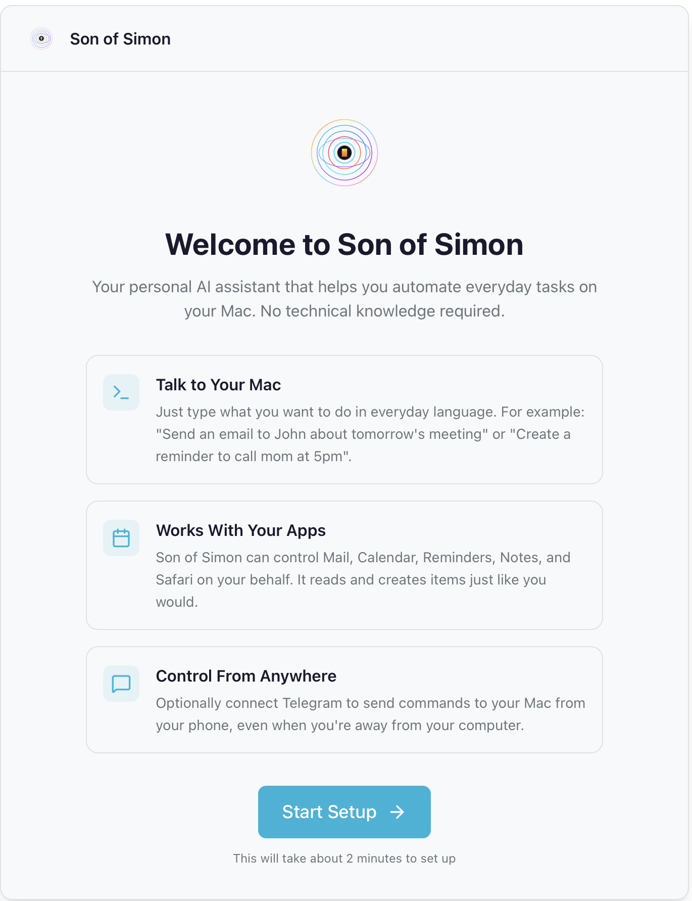

<p align="center">
  
</p>

<h1 align="center">Son of Simon</h1>

<p align="center">
  <em>Your personal Mac assistant. Built-in apps. Voice messages. No setup headaches.</em>
</p>

---

## What is this?

Son of Simon is a personal assistant for macOS. It helps you with everyday tasks using the apps you already have - Mail, Calendar, Reminders, Notes, and Safari. It can also handle websites when needed.

You do not need to code. Most people just download the app, sign in, and start asking.

## What it can do

- Summarize your inbox and find important emails
- Create calendar events and reminders
- Search your notes
- Open and control Safari tabs
- Fill out simple web forms (bookings, purchases, etc.)
- Send and receive messages over Telegram (text or voice)
- Run daily or weekly routines (optional)

## How it works (simple version)

- It uses your built-in Apple apps instead of screen scraping
- It uses the browser only when it has to
- It can listen to your Telegram voice messages if you want remote control

## Get started (most people)

1. Download the latest `.dmg` from Releases
2. Drag Son of Simon to your Applications folder
3. Open it and follow the setup steps

The setup wizard will guide you through:
- Connecting your AI provider (OpenAI, Anthropic, or another provider)
- Granting macOS permissions
- Optional Telegram setup

<p align="center">
  
</p>

## Requirements

- macOS
- Apple apps configured (Mail, Calendar, Reminders)
- Internet access for your AI provider
- Optional: Telegram bot for remote access

## Privacy and safety

- Your email, calendar, and reminders stay in Apple apps
- The assistant sends prompts to your AI provider to understand your request
- If you enable Telegram, messages go through Telegram
- Local data is stored in `~/.macbot` (settings, logs, and memory)

## OpenClaw vs Son of Simon (simple)

- **OpenClaw** is cross-platform and connects many messaging apps.
- **Son of Simon** is Mac-first and works directly with built-in Apple apps.
- **OpenClaw** runs a gateway with extra setup. **Son of Simon** is a single app with a guided setup.
- **OpenClaw** has a broader skills ecosystem. **Son of Simon** keeps tasks built-in and local by default.

If you want a cross-platform hub, OpenClaw is great. If you want a Mac-first assistant that is fast and reliable, Son of Simon is the better fit.

## Optional extras

- Paperless-ngx integration for documents
- Time tracking
- Scheduled jobs (daily or hourly tasks)

## Advanced (run from source)

If you want to run Son of Simon from this repository:

```bash
pip install -e .
son onboard
son run "Check my emails and summarize urgent ones"
```

Common commands:

| Command | Description |
|---------|-------------|
| `son run "<goal>"` | Run a natural language goal |
| `son chat` | Interactive chat mode |
| `son start` | Start background service (Telegram + cron) |
| `son doctor` | Verify setup and permissions |

## License

MIT License
