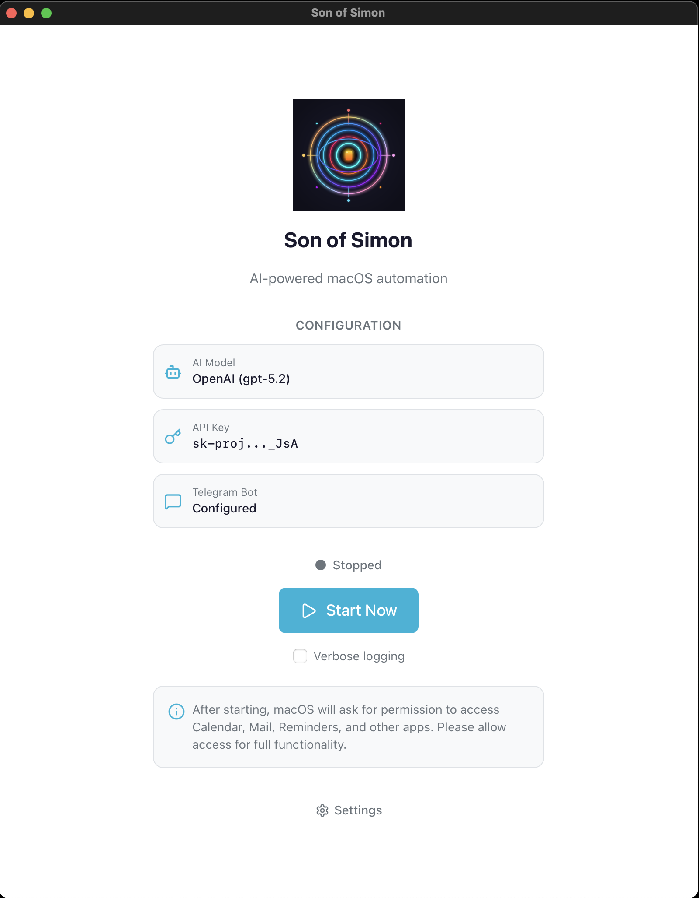

<p align="center">
  
</p>

<h1 align="center">Son of Simon</h1>

<p align="center">
  <em>An LLM-powered agent for macOS automation. Give natural language commands, it figures out the rest.</em>
</p>

<p align="center">
  
  &nbsp;&nbsp;
  
</p>

---

## Why Son of Simon?

Computer-use agents are powerful but often require you to code every interaction or rely on fragile screen scraping. Son of Simon takes a different approach: **use what macOS already gives you**.

Every Apple app—Mail, Calendar, Reminders, Notes, Safari—is scriptable via AppleScript. This means the agent can read your emails, create events, and manage reminders through official APIs, not pixel hunting. It's fast, reliable, and works even when windows are hidden.

The tradeoff? Your accounts live in Apple's apps. But that's actually a feature: one place for credentials, native sync across devices, and no need to hand API tokens to yet another service.

For everything else—booking restaurants, checking prices, filling forms—browser automation handles the web. A hybrid approach: native where it matters, flexible where it doesn't.

Son of Simon also integrates seamlessly with Telegram. Send a voice message while you're on the go—foundation models like GPT handle audio natively, so your spoken request just works. No extra transcription step, no friction.

## Features

- **macOS Automation** - Control Mail, Calendar, Reminders, Notes, and Safari via natural language
- **Telegram Integration** - Send commands via text or voice, receive responses with conversation context
- **Multi-LLM Support** - OpenAI, Anthropic, Groq, Ollama, and 100+ providers via LiteLLM
- **Paperless-ngx Integration** - Search, upload, and download documents from your paperless instance
- **Scheduled Jobs** - Run automated tasks on intervals or cron schedules
- **Browser Automation** - ARIA-based web interaction with screenshots and element detection
- **Voice Commands** - Send voice messages via Telegram, automatically transcribed via Whisper

## Use Cases

**"Book a table for dinner"** — Ask Son of Simon to book a restaurant for Saturday evening. It searches the web, finds the booking page, fills out the form, and confirms the reservation.

**"What's in my inbox?"** — Get a summary of your unread emails. Ask follow-up questions like "any tracking numbers?" or "reply to the Amazon one saying thanks."

**"Remind me about my dentist appointment"** — Son of Simon checks your calendar and creates a reminder. Or ask it to reschedule if something came up.

**"Where's my package?"** — Son of Simon searches your emails for tracking numbers, checks the carrier's website, and tells you when it'll arrive.

**"Morning briefing"** — Set up a daily job that sends you a Telegram message with today's calendar, pending reminders, and important emails.

**"Track my time on this project"** — Start and stop timers for client work. Get weekly reports of how you spent your hours.

**"Find my tax documents"** — If you use Paperless-ngx, Son of Simon searches your document archive and can download what you need.

**"Just talk to it"** — Send a voice message via Telegram while you're on the go. Son of Simon transcribes it and gets to work.

## Prerequisites

- **macOS** — Son of Simon uses AppleScript to control native apps
- **Python 3.10+** — Required for the runtime
- **LLM API key** — OpenAI, Anthropic, or any provider supported by LiteLLM
- **Apple apps configured** — Set up Mail, Calendar, and Reminders with your accounts
- **Automation permissions** — Grant Terminal (or your IDE) permission to control apps in System Settings → Privacy & Security → Automation

**Optional:**
- **Telegram bot** — For remote access via text or voice ([create one with @BotFather](https://t.me/BotFather))
- **Paperless-ngx** — For document search and management

## Quick Start

```bash
# Install
pip install -e .

# Interactive setup wizard
son onboard

# Run a goal
son run "Check my emails and summarize urgent ones"

# Multiline prompt
son run -m

# Start service (Telegram + cron jobs)
son start
```

## Commands

| Command | Description |
|---------|-------------|
| `son run "<goal>"` | Run a natural language goal |
| `son run -m` | Run with multiline input (Ctrl+D to end) |
| `son chat` | Interactive conversation mode |
| `son start` | Start service (Telegram + cron) |
| `son stop` | Stop the service |
| `son status` | Check service status |
| `son doctor` | Verify setup and permissions |
| `son onboard` | Interactive setup wizard |
| `son tasks` | List available tasks |
| `son cron list` | List scheduled jobs |

## Configuration

Run `son onboard` for interactive setup, or create `~/.macbot/.env`:

```bash
# LLM Model (provider/model format)
MACBOT_MODEL=openai/gpt-4o
MACBOT_OPENAI_API_KEY=sk-...

# Or use Anthropic
# MACBOT_MODEL=anthropic/claude-sonnet-4-20250514
# MACBOT_ANTHROPIC_API_KEY=sk-ant-...

# Or use other providers (Groq, Ollama, etc.)
# MACBOT_MODEL=groq/llama3-70b-8192
# GROQ_API_KEY=gsk_...

# Telegram (optional)
MACBOT_TELEGRAM_BOT_TOKEN=123456:ABC...
MACBOT_TELEGRAM_CHAT_ID=your_chat_id

# Paperless-ngx (optional)
MACBOT_PAPERLESS_URL=http://localhost:8000
MACBOT_PAPERLESS_API_TOKEN=your_token

# Agent settings
MACBOT_MAX_ITERATIONS=100
```

## Available Tasks

**Mail** - `search_emails`, `send_email`, `move_email`, `mark_emails_read`, `download_attachments`

**Calendar** - `get_today_events`, `get_week_events`, `create_calendar_event`, `list_calendars`

**Reminders** - `create_reminder`, `complete_reminder`, `list_reminders`, `get_due_today_reminders`

**Notes** - `create_note`, `search_notes`, `list_notes`

**Safari** - `get_current_safari_page`, `open_url_in_safari`, `list_safari_tabs`, `extract_safari_links`

**Browser** - `browser_navigate`, `browser_click`, `browser_type`, `browser_screenshot`, `browser_snapshot`

**Paperless** - `paperless_search`, `paperless_upload`, `paperless_download`, `paperless_list_tags`

**Telegram** - `telegram_send`

**Web** - `web_search`, `web_fetch`

**Time Tracking** - `timer_start`, `timer_stop`, `timer_status`, `timer_report`

**Memory** - `memory_add_fact`, `memory_add_lesson`, `memory_set_preference`, `memory_list`

**System** - `get_system_info`, `read_file`, `write_file`, `run_shell_command`

## Scheduled Jobs

Create `jobs.yaml`:

```yaml
jobs:
  - name: "Morning Briefing"
    goal: |
      Give me a morning briefing:
      - Unread emails summary
      - Today's calendar
      - Reminders due today
    cron: "0 9 * * *"
    timezone: "Europe/Berlin"

  - name: "Email Check"
    goal: "Check for urgent emails and notify me via Telegram"
    interval: 300  # every 5 minutes
```

```bash
son cron import jobs.yaml
son start -d  # Start as daemon
```

## Telegram Usage

1. Create a bot via [@BotFather](https://t.me/BotFather)
2. Run `son onboard` to configure
3. Start service: `son start`
4. Send text or voice messages to your bot

Special commands in Telegram:
- `/reset`, `/clear`, `/new` - Start a fresh conversation

Conversation context is preserved between messages for natural back-and-forth chat.

## Examples

```bash
# Email management
son run "Find emails from Amazon this week and list any with tracking numbers"

# Calendar
son run "What meetings do I have tomorrow? Create reminders 15 min before each"

# Bookings
son run "Book a table at Restaurant Eichenhof for Saturday 7pm, 2 people"

# Paperless
son run "Search paperless for invoices from 2024"

# Browser automation
son run "Open google.com, search for 'weather', and take a screenshot"

# Time tracking
son run "Start a timer for client work"
son run "Stop the timer"
son run "Show my time report for this week"

# Complex workflows
son run "Check my emails, archive newsletters, and send me a Telegram summary"
```

## Architecture

```
~/.macbot/
├── .env              # Configuration
├── cron.json         # Scheduled jobs
├── memory.db         # Agent memory (processed emails, etc.)
├── knowledge.yaml    # Learned facts and preferences
├── time_tracking.db  # Time entries
└── service.log       # Service logs

src/macbot/
├── cli.py            # Command-line interface
├── config.py         # Settings management
├── service.py        # Unified service (cron + telegram)
├── core/
│   └── agent.py      # ReAct agent loop
├── providers/
│   └── litellm_provider.py  # Multi-LLM support
├── tasks/            # Task implementations
│   ├── macos_automation.py
│   ├── browser_automation.py
│   ├── paperless.py
│   ├── time_tracking.py
│   └── telegram.py
└── telegram/         # Telegram integration
```

## License

MIT License
