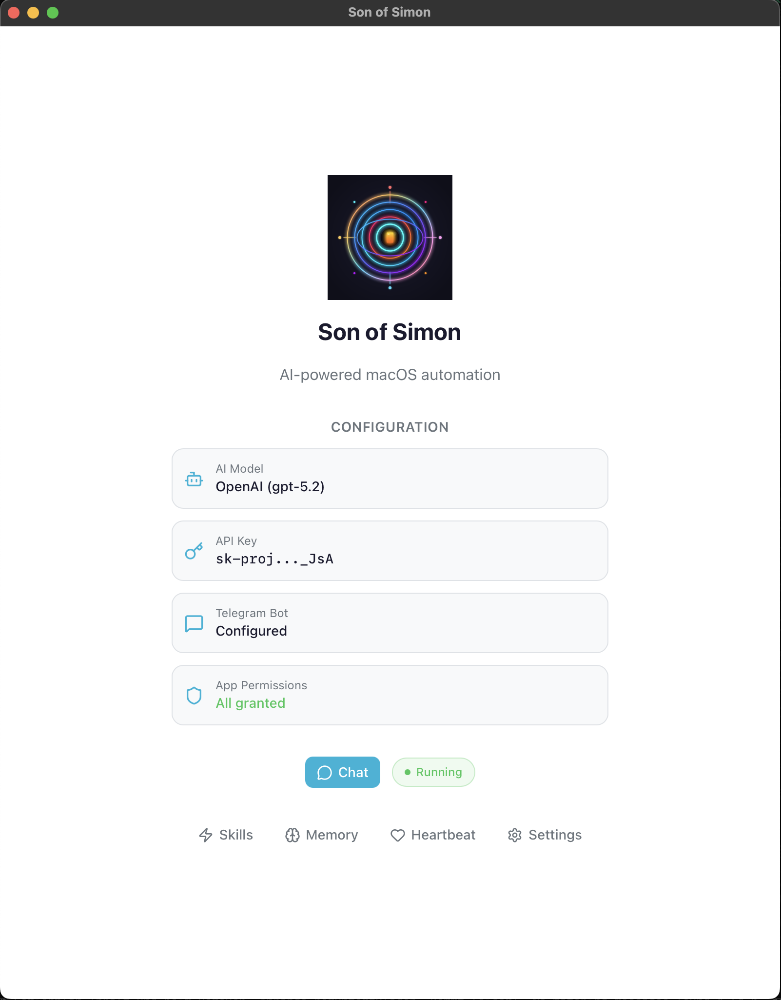

  

<h1 align="center">Son of Simon</h1>

  <em>Your personal Mac assistant. Built-in apps. Voice messages. Secure by default. No setup headaches.</em>

## Why

Your Mac is already set up. Why should an AI make you do it again with OAuth and gateways?

## What is this?

Son of Simon is an AI assistant for macOS that works directly with your built-in Apple apps — Mail, Calendar, Reminders, Notes, and Safari. Add your account in Apple Mail/Calendar and the agent can use it. You do not need to code. Download the app, sign in, and start asking.

|  | Son of Simon | Claude / ChatGPT | OpenClaw |
|---|---|---|---|
| **Control Apple apps** | Yes — Mail, Calendar, Reminders, Notes, Safari | No | Limited |
| **Setup** | One app, guided wizard | Browser sign-in | Complex, error-prone |
| **Passwords / tokens** | Never accessed — apps are already signed in | Not needed | Stores OAuth tokens |
| **Skills ecosystem** | [AgentSkills](https://agentskills.io) / [ClawHub](https://clawhub.ai) | Plugins / GPTs | AgentSkills |

For a detailed comparison with OpenClaw, see [docs/COMPARISON.md](docs/COMPARISON.md).

## What it can do

**Mail** — search, read, send, archive, download attachments across all accounts

**Calendar & Reminders** — create events, check your schedule, set reminders, mark them done

**Notes** — create, search, organize into folders, move and delete notes

**Safari & Browser** — open URLs, read pages, click buttons, fill forms, take screenshots, run JavaScript

**WhatsApp** — read chats, search messages, send replies via `whatsapp-cli`

**Telegram** — send and receive messages (text or voice), use as remote control for the agent. Voice messages (both transcription and voice replies) require an OpenAI API key.

**Microsoft Teams** — list teams and channels, read and send channel and chat messages (multi-account)

**Spotlight** — find files by name, content, type, or recently opened

**Paperless-ngx** — search, upload, download, and tag documents

**Web** — Google search, fetch URLs, read Hacker News

**Files** — read, write, and search files on disk

Because it chains tools automatically, you can ask for things like:
- *"My mom sent me her vacation dates by email — add them to my calendar"*
- *"Summarize my unread emails and send me a Telegram message with the highlights"*
- *"Find the PDF invoice from last week and upload it to Paperless"*

## Get started

1. Download the latest `.dmg` from Releases
2. Drag Son of Simon to your Applications folder
3. Open it and follow the setup steps

The setup wizard will guide you through:
- Connecting your AI provider (Anthropic, OpenAI, OpenRouter, or Pico for local models)
- Choosing a model (Claude, GPT-5, DeepSeek, Gemini, Llama, or any model running locally)
- Granting macOS permissions
- Optional Telegram setup

First success (safe demo prompts):
- "What's on my calendar today? (Read-only.)"
- "Summarize my unread emails and highlight anything urgent. Don't reply or send anything."
- "Search my Notes for anything about &lt;keyword&gt; and summarize what you find."

  

## Skills

Son of Simon comes with built-in skills for Mail, Calendar, Reminders, Notes, Safari, and Browser Automation. Skills use the [AgentSkills standard](https://agentskills.io) — community skills from [ClawHub](https://clawhub.ai) work out of the box. See [docs/SKILLS.md](docs/SKILLS.md) for custom skills, CLI commands, and ClawHub install instructions.

## AI providers

Works with cloud providers — Anthropic, OpenAI, and OpenRouter — or run models locally on your Mac with [Pico AI Server](https://apps.apple.com/app/pico-ai-server/id6502491545). No API key needed for local models. Pick a provider during setup or switch any time. See [docs/AI_PROVIDERS.md](docs/AI_PROVIDERS.md) for the full model table.

## Memory and Heartbeat

Son of Simon remembers context between conversations — preferences, habits, and patterns — in a local memory file (`~/.macbot/memory.yaml`). You can read, edit, or delete it at any time. The heartbeat (`~/.macbot/heartbeat.md`) runs a prompt periodically while the service is active, useful for recurring checks like scanning for urgent emails or upcoming meetings. All data stays on your Mac under `~/.macbot/`.

## Requirements

- macOS
- Apple apps configured (Mail, Calendar, Reminders)
- An AI provider: cloud API key **or** [Pico AI Server](https://apps.apple.com/app/pico-ai-server/id6502491545) for fully offline local inference
- Optional: Telegram bot for remote access

## Secure by default

No stored passwords — macOS Keychain handles authentication. No local gateway required — AppleScript talks to your apps directly. Your prompts go to your chosen LLM provider; nothing else leaves your Mac. See [docs/SECURITY.md](docs/SECURITY.md) for the full security model and privacy details.

## Optional extras

- **Microsoft Teams** — Ask the agent to "set up Teams". The [Azure CLI](https://learn.microsoft.com/en-us/cli/azure/) (`brew install azure-cli`) handles the Azure AD app registration so you never need to navigate the Azure Portal. Supports multiple accounts (e.g., work + personal tenant). See [Teams setup guide](docs/TEAMS_SETUP.md) for details.
- Paperless-ngx integration for documents
- Time tracking
- Scheduled jobs (daily or hourly tasks)

## Learn more

- [Skills](docs/SKILLS.md) — custom skills, CLI commands, ClawHub
- [AI Providers](docs/AI_PROVIDERS.md) — supported models and configuration
- [Security & Privacy](docs/SECURITY.md) — security model, data egress, permissions
- [OpenClaw Comparison](docs/COMPARISON.md) — feature comparison with OpenClaw
- [Development](docs/DEVELOPMENT.md) — CLI usage, running from source, building
- [Teams Setup](docs/TEAMS_SETUP.md) — Microsoft Teams integration guide

## License

MIT License
