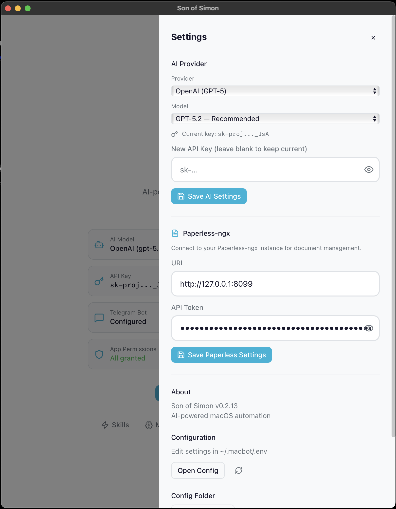

# AI Providers and Models

Son of Simon works with multiple AI providers. Pick one during setup or change it later in `~/.macbot/.env`.

| Provider | Models | Key prefix |
|---|---|---|
| **Anthropic** | Claude Sonnet 4.5, Opus 4.6, Haiku 4.5 | `sk-ant-` |
| **OpenAI** | GPT-5.2, GPT-5.2 Pro, GPT-5.1, GPT-5 Mini, o4-mini | `sk-proj-` |
| **OpenRouter** | DeepSeek V3.2, Gemini 2.5 Flash/Pro, GLM 4.7, Llama 4 Maverick, Qwen 3, Grok 4.1 | `sk-or-` |
| **Pico** (Local) | Llama 3.2, DeepSeek R1, Gemma 3, Qwen 2.5, 300+ via Pico | No key needed |

OpenRouter gives you access to dozens of models with a single API key. Good if you want to experiment.

Pico AI Server lets you run models locally on your Mac using Apple Silicon. No API key or cloud account needed — just install from the [Mac App Store](https://apps.apple.com/app/pico-ai-server/id6502491545), download a model, and go.

<p align="center">
  
</p>

## Configuration

Set your provider and API key in `~/.macbot/.env`:

```bash
# Cloud provider (pick one)
MACBOT_MODEL=anthropic/claude-sonnet-4-5
MACBOT_ANTHROPIC_API_KEY=sk-ant-...

# Or use Pico for local inference (no API key needed)
MACBOT_MODEL=pico/llama3.2
MACBOT_PICO_API_BASE=http://localhost:11434
```

You can also configure this through the setup wizard or the dashboard settings page.
